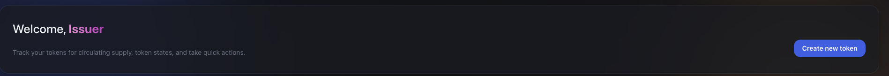
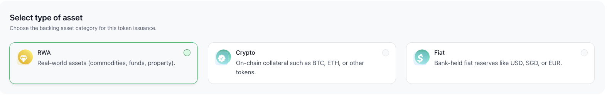
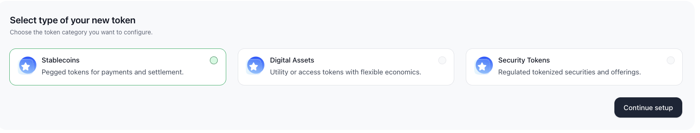
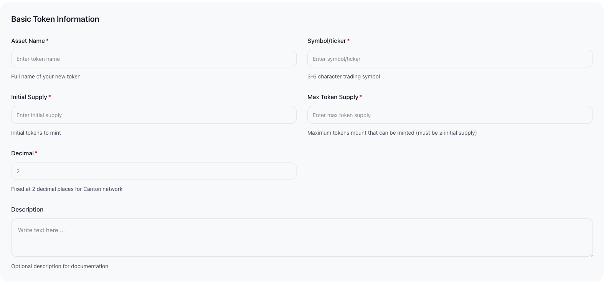
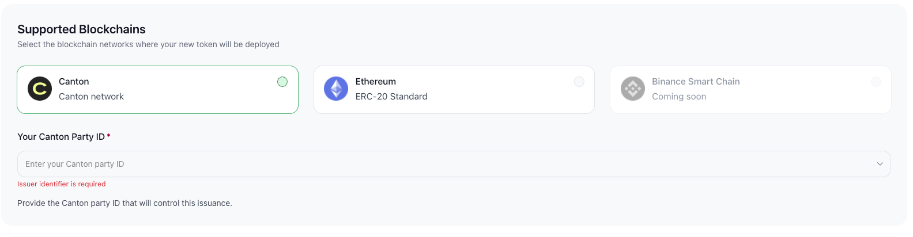
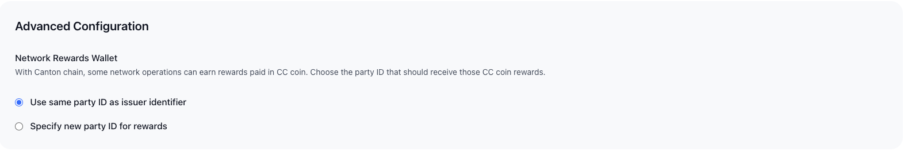
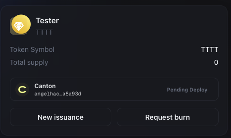
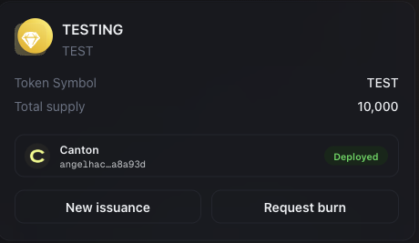

# Tokenization Walkthrough

This guide provides a step-by-step overview of how to create and manage a tokenized asset on the platform.

The process includes token configuration, authorization setup, approval, and post-deployment supply management.

---

## Overview of Flow

1. Create Token  
2. Configure Asset & Token Type  
3. Provide Token Metadata  
4. Assign Control PartyId(s)  
5. Submit for Approval  
6. Deploy & Manage Supply  

---

## Step 1: Create Token

From the dashboard, click **"Create Token"**.

This initiates the token setup workflow.

---

## Step 2: Select Asset Backing Type

Choose the type of asset backing the token.

---

## Step 3: Select Token Type

Choose the token structure that best fits your issuance model.

---

## Step 4: Fill in Token Information

Provide the required token metadata:

Ensure all details are accurate before submission.

---

## Step 5: Select Controlling PartyId

Select the **PartyId authorized to manage token lifecycle operations**.

This PartyId will have permission to:

- Mint tokens
- Burn tokens
- Control total supply

Only **authorized** `PartyId` should be selected.

---

## Step 6 (Optional): Select App Reward PartyId

You may optionally assign a different PartyId to receive application-level rewards.

If not specified, rewards defaults to the controlling PartyId.

This separation can be useful for operational or accounting purposes.

---

## Step 7: Submit for Token Creation

Once all information is completed:

Click **Submit** to request token creation.

The token status will appear as:
> **Pending Approval**

---

## Step 8: Manual Review & Approval

For security, compliance, and KYC purposes:

- All token creation requests undergo manual review.
- The platform operator will validate issuer credentials and configuration details.

This step ensures regulatory and operational integrity.

---

## Step 9: Token Deployment

Once approved:

- The token will be deployed on the network.
- Its status will change to **Deployed**.
- You will be able to view token details in your dashboard.

At this stage, the token contract is active.

---

## Step 10: Mint or Burn Tokens

After deployment, you may request:

- **Minting** — Increase circulating supply  
- **Burning** — Reduce circulating supply  

These operations must be executed using the authorized controlling PartyId.

Supply changes are recorded on the ledger.

---

## Summary

The tokenization lifecycle follows this flow:

Create → Configure → Approve → Deploy → Manage Supply

If you require assistance at any stage, please contact the team.